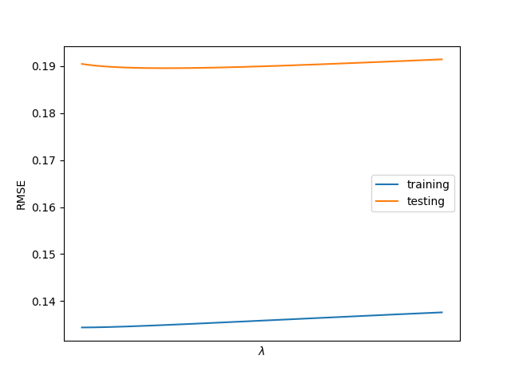

#Regularized Linear Regression

This is just an in-class assignment, not something to turn in.

I've added a dataset on wine quality.  There are two datasets, one for red wines, and one for white.  The dataset is explained in winequality.name.  Your goal is to predict the wine quality from the other factors using linear regression.

Linear regression is easy to implement and fast to compute.  The real question is what regularization parameter ($\lambda$) should be used?  To find this out, build yourself a training set and a testing set, and for a variety of $\lambda$s, calculate and plot the training error and testing error to find the $\lambda$ which results in the best testing error.  Your plot might look like this,



only with values not unhelpfully hidden on the x-axis.  Do this for both the red and white wines.  Use this to determine a good value of $\lambda$.

Feel free to use `sklearn`'s function `Ridge` for this.  Make sure normalization is on!

Just to make things a little faster, here's some stuff you definitely know how to do, done for you.  Here's my code which reads this data in.

```python
parser=argparse.ArgumentParser()
parser.add_argument("filename",help="which file to read")
filename=parser.parse_args().filename

pdObj=pd.read_csv(filename,sep=';').values
X=pdObj[:,:-1]
y=pdObj[:,-1]
#X is now the features, and y is the targets
```

###Cross Validation

Run your code twice - do you get the same graph?  Probably not, if your train/test split was done randomly (which it should be).  They may not even be particularly close!  That's a bummer, and makes your results suspect.

This model (fast to train!) and dataset (small and noisy!) are good candidates for cross-validation.  Remember that in cross-validation:

```
for each candidate value of lambda:
  for each data point:
    Make that single data point the test set, and everything else the training set
    Train on the training set, and calculate the error on the one held out data point
  calculate the average error on the single held out point
```

This error is a better predictor of out-of-sample error because you get to train on all your data, rather than a percentage of an already-small dataset.  However, it requires much more computation.

Again, do this for a variety of $\lambda$s, and tell me which is best.
