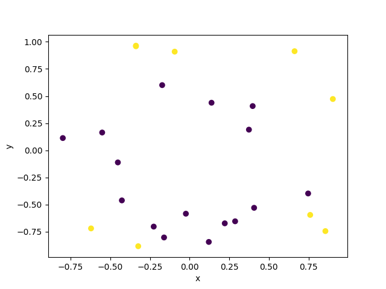
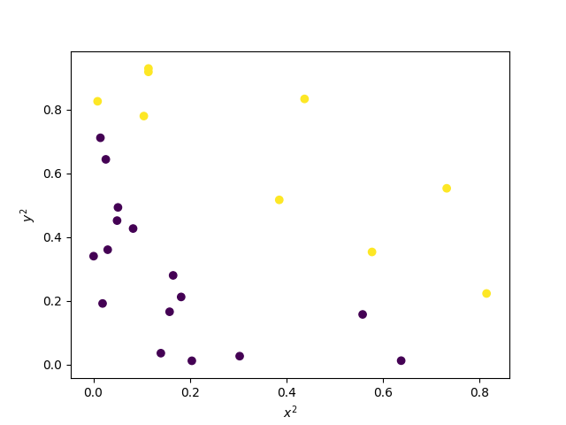
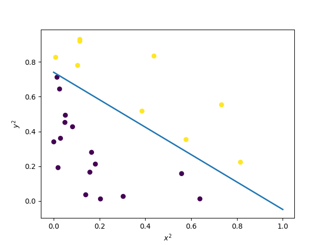
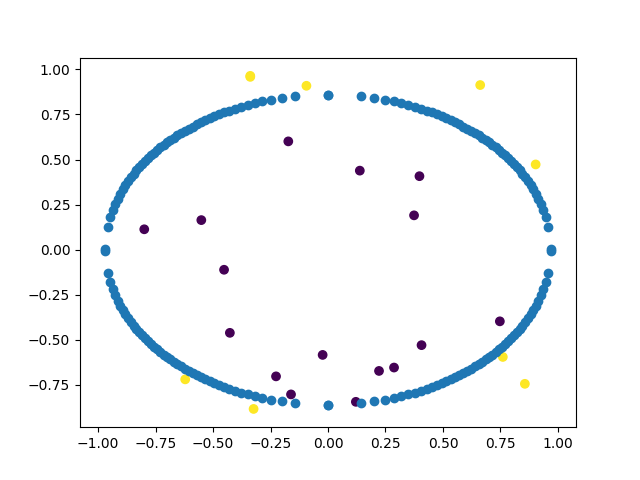

# Feature Manipulation

In this class, we're primarily (though not entirely) going to be working with linear models, where the question of "what can we do with linear combinations of our features" is the core idea.  Of course, if the vector space defined by your features isn't useful, the answer is, "not very much."  This can seem extremely limiting.  For example, consider the following classification problem:

In this example, our features are the x-coordinate, and the y-coordinate (and probably a basis feature of all 1s).  Now, we know that perceptrons only are useful if the data is linearly separable.  We've also learned about the pocket algorithm, which is useful if the data is *almost* linearly separable.  This data, however, isn't even close!  There is no line, in this feature space, that cleanly separates blue dots from red dots, so a perceptron will be useless.

Or will it?  A very, very, very important idea is that in linear models, you are limited to linear combinations of features, but you can use literally any features you want!  This basic idea makes linear models very powerful.  For example, for this data, suppose rather than using the features $[x,y]$, we instead used the features $[x^2,y^2]$?  That is, suppose we had a dot at $[-1,.5]$.  Well, rather than having its row in the matrix represented with those two numbers, I'll instead use $[-1^2, .5^2]$, or $[1,0.25]$.  If I do this for all points in this set, and plot it on this new $x^2, y^2$ axes, this is what I get:

That data is entirely separable, and we can build a dependable classifier with a perceptron, as shown here.  

The line in this image is the *decision boundary*, such that things on one side are in the black set, and things on the other are in the yellow set.  Of course, since it's been made by a perceptron, it's linear.  If we were to move every point on that line back to the original data set, though, it wouldn't be.  By that, I mean that every point on that line in $(x^2,y^2)$ space, maps to (actually 4) points in the original space: $(\sqrt{x^2},\sqrt{y^2}),(-\sqrt{x^2},\sqrt{y^2}),(\sqrt{x^2},-\sqrt{y^2}),(-\sqrt{x^2},-\sqrt{y^2})$.  That looks like this:

Again, everything on one side of this decision boundary is black, and everything on the other is yellow.  And it's still a linear classifier - but not in the original space!  We've used a linear classifier to make a non-linear decision boundary.  And that's OK!  And normal!  And super, super powerful!

We're going to explore this quite a bit in this class, as its an extremely important idea.  In a linear model, you are limited to linear combinations of your features, but your features can be whatever you want!
