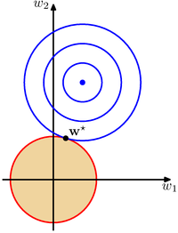
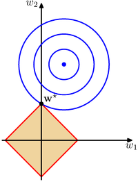

# Regularized Linear Regression

I don't love the discussion on Regularized LR in the LFD book (4.2, if you want to give it a shot), so I'm stuck here writing it all up myself.  Fortunately, it's not hard.

Overfit solutions are characterized by large, rapidly changing gradients, by which I mean the lines of best fit oscillate wildly up and down.  A solution without these large gradients will do better.

Let's suppose that we have a prediction $\hat y$, based off a data matrix $X$ and a weight vector $w$ as follows:

$$
\hat y=\left[\begin{array}{ccc}
a_1&b_1&1\\
a_2&b_2&1\\
\vdots&\vdots&\vdots\\
a_n&b_n&1
\end{array}\right]
\left[\begin{array}{c}
w_1\\
w_2\\
w_3\end{array}\right]
$$

The partial derivatives $\frac{\partial \hat y}{\partial a}$ and $\frac{\partial \hat y}{\partial b}$ are, of course, equal to $w_1$ and $w_2$, respectively.  So, if the weights are small, the gradient will be small.  What we want is a solution that fits the data well, and has small weights.  This is known as "weight decay," because we're encouraging weights to decay towards zero.

As you might imagine and fear, there are a number of ways to talk about how "small" a vector $w$ is.  The most common is the sum of squares of the weights, ie, $\sum_i w_i^2$, or, the dot product of $w$ with itself, $w^Tw$ (this is called the $L_2$ norm of the vector).  So, just as we punish a $w$ that produces a large error when approximating $y$ (using $E_{in}(w)$), we're also going to punish a $w$ that has a large $L_2$ norm.  So:

$$
\begin{align*}
&\min_w E_{in}(w)+\lambda w^Tw\\
=&\min_w\sum_{i=1}^N(w^Tx_i-y_i)^2+\lambda w^Tw
\end{align*}
$$

The $\lambda$ is a tradeoff parameter, just a simple scalar, that helps us decide how much we want to prioritize a good fit vs a small weight vector. 

As with unregularized linear regression, we take the derivative and set it equal to zero, and end up with a pleasingly simple:

$$
w=(\lambda I + X^TX)^{-1}X^Ty,
$$

where $I$ is the square identity matrix, consisting of all zeros, except for 1s along the diagonal (the size of $I$ can be inferred by the math done to it - in this case, it is being added to a $k\times k$ matrix, so it must be of size $k\times k$).  Using this solution is called *linear regression with $L_2$ regularization*, or simply *ridge regression*.

# Normalization

With the introduction of regularization, *normalization* or *standardization* can become very important.  Consider the following two features:

$$
X=\left[\begin{array}{cc}
30&3\\
10&1\\
-20&-2
\end{array}\right]
$$

Clearly, these two features carry the same information.  However, one is at a much larger scale than the other.  Recall that when we regularize, we encourage weights to be small.  A weight associated with the first feature can be smaller than a weight associated with the second feature and express the same thing.  So, we're not letting the data decide which features to weight more heavily, we've accidentally biased it towards favoring the first to the second.

For this reason, it's common to normalize, or standardize, your data before fitting a regularized model.  These two words are roughly synonyms - they mean that it's best to adjust all your features to be in the same scale as each other.  Both require the means of all features to be set to zero.  Normalize usually means to then divide so that the magnitude of the vector is 1.  Standardize usually means to divide so the standard deviations of all vectors are 1.  I usually prefer standardization, but it's a personal preference thing.

Remember to adjust your test set in the same way!

# Finding your $\lambda$

How do we decide $\lambda$? Two possible ways.

The first is to split your data into training and testing sets, and then simply performing ridge regression with differing values of $\lambda$, keeping the one that does the best on the test set.

You may find, however, that for different random choices of test sets, you get different best values of $\lambda$.  This will especially happen with small datasets, where your small test set is more likely to be somehow different from the whole dataset.  This can call for *cross validation*.  In cross validation, rather than holding out a test set, you hold out a single test example, train on the rest, then see how you predict on that single example.  You then hold out a different test example, retrain, and see how you predict on that.  Your average performance on the one new example for a given value of $\lambda$ stands in as your test set performance.

This makes better use of small amounts of data, as you get to train on (almost) everything, but is obviously much more computationally expensive.

[You can see a demo of these concepts here.](14regLinRegDemo)

<!-- #The Lasso, or, $L_1$ Regularization

Above we saw $L_2$ regularization, where we punished weights when the sum of their squares was large.  This is not the only way of talking about a vector being large or small.

Another common norm used for regularization is $L_1$ regularization, here, rather than penalize $\sum_i w_i^2$, we penalize $\sum_i \left|w_i\right|$.  This leaves us with an error term of:

$$
\min_w\sum_{i=1}^N(w^Tx_i-y_i)^2+\lambda \sum_j \left| w_j\right|.
$$

This seems like a small change.  As with ridge regression, as individual weights increase, the penalty increases.  There are a couple major results from this, though.

The bad news is that this is no longer so easy to solve for.  We can no longer just take the gradient and set it equal to 0, because the $L_1$ norm isn't differentiable when some weight=0.  So, the gradient doesn't exist like that.  Fortunately, it's still a convex optimization problem, so we won't have to work too hard.

The good news is that this amazingly results in a *sparse* solution, meaning that not only are weights encouraged to be small, but many of those weights will actually be 0!  To see why, let's first think about ridge regression, looking at the following picture, which I've taken from Bishop's "Pattern Recognition and Machine Learning":

Here, the dot is the best, unregularized solution.  The concentric circles are like topographical lines - they indicate points that are equally bad from each other - as you move away from that center dot, the solutions fit the training data worse.  However, that's not our only consideration, here.  We're also doing ridge regression, so we also have to consider the solution's distance from the origin in $L_2$ space.  Now, all points on the red circle have the same sum of squares distance from the origin.  These two considerations meet at $w*$, our ridge regression solution.

Now, when we switch to $L_1$, our definition of distance from the origin changes.  Look at this picture:

The red diamond is the points where the sum of the absolute values of the weights are equal.  The blue concentric circles are identical.  Notice the two parts of our error function meet at $w*$, where $w_1=0$.  Our solution is *sparse*.

Now, this isn't guaranteed to happen, but it's quite likely.

This is mostly helpful for interpretability.  If you have quite a few features, and many of them receive a corresponding weight of 0, you can say that they're not necessary to predict your target values - you can stop collecting them entirely.

If you don't care about interpretability, there's no real advantage.

Linear regression with $L_1$ regularization is known as the "Least Absolute Shrinkage and Selection Operator," or LASSO.-->
