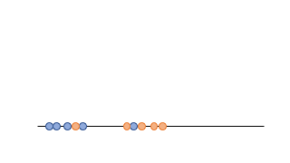
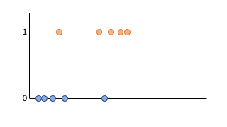
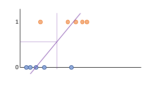
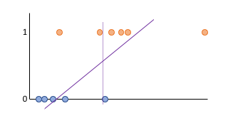
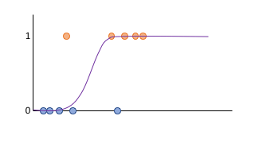

# Logistic Regression

Again, this is intended to be a supplement to your reading.

## Understanding visually

Our only classification algorithm that we know so far is the perceptron, which is very limited.  It's not that fast, and it requires that the data be linearly separable, an unlikely condition.  So, it'd be good to use something else.  Now, we have a pretty limited toolbox at the moment - what if we used linear regression?  After all, classes can be given numerical targets (this class is has a target of 0, and this class has a target of 1), and regression predicts numerical targets.  Could make some sense.

In the following picture, we have some blue and orange points in 1D space.  We'd like to build a classifier that predicts if a new point on this numberline is blue or orange.

Now, these points aren't linearly separable in this space, so we can't use a perceptron.  Let's say the blue points are in class 0, and the orange points are in class 1.  We add this dimension, to reflect their labels:

We now try to fit a line to these points, and claim that every time the predicted value of that line is >0.5, it's in class 1, and when it's <0.5, it's in class 0.

That isn't so bad!  This could work great!  Now, suppose we add one more orange point, way over to the right.  Our classifier is already getting this correct, so ideally not much should change.  Unfortunately, it drags the regression line way over to the right, as well, and the classifier is now worse.

So that's no good.

Of course, lines aren't the only things we can fit.  We can fit quadratics, cubics, whatever we want.  We can even fit a function shaped like an 'S' - the logistic sigmoid! As stated in your book, the logistic sigmoid is written as $\theta(s)=\frac{e^s}{1+e^s}$.  Then it would look (roughly) like this:

We could still use the >.5 test as our classifier, and now the addition of already-correct points won't change the regression too much.  Additionally, if the sigmoid gives you a value quite close to 0, it's almost definitely a blue dot.  If it's quite close to 1, it's almost definitely an orange dot, so it doesn't just give you a class, it gives you a sense of how sure you are about that.

Now, this logistic sigmoid doesn't seem to have any parameters to turn, like our linear regression.  So when we say "best fit," what are we changing to make it fit better or worse?  The answer is that we're going to replace $s$ in the logistic regression function with $s=w^Tx$, which should be quite familiar to you.  Now, by changing $w$, we change the value being fed into the logistic sigmoid, and so it will fit better or worse.

## It's not just intuition

The above makes good graphical, intuitive sense.  However, there's another way of looking at it, that's much more precise and grounded, by looking at it through probability.

Let's say that our targets (classes) are 1 or -1, and we're going to start off with the following modeling assumption:

$$
p(y|x)=\begin{cases}
  \theta(w^Tx) & y=1\\
  1-\theta(w^Tx) & y=-1
\end{cases}
=\theta(yw^Tx)
$$

Now, our goal is to find the *maximum likelihood* solution, which means, the value of $w$ that makes the above as large as possible for our whole dataset.  The above is for one datapoint - we can extend this to a whole dataset by assuming independence, and saying we want to solve the following optimization problem.  I then walk it through a number of algebraic steps:

$$
\begin{align*}
&\max_w \prod_{i=1}^N p(y_i|x_i)\\
&\min_w -\prod_{i=1}^N p(y_i|x_i) ~~~\text{(max of a positive is the min of the negative)}\\
&\min_w -\ln\left(\prod_{i=1}^N p(y_i|x_i)\right) ~~~\text{(logarithms are monotonic, so minimizing ln(x) is the same as minimizing x)}\\
&\min_w \ln\left(\prod_{i=1}^N \frac{1}{p(y_i|x_i)}\right) ~~~(a\ln(b)==ln(b^a))\\
&\min_w \sum_{i=1}^N \ln\left(\frac{1}{p(y_i|x_i)}\right) ~~~(\ln(ab)==\ln(a)+ln(b))\\
&\min_w \sum_{i=1}^N \ln\left(\frac{1}{\theta(y_iw^Tx_i)}\right) ~~~(\text{by definition})\\
&\min_w \sum_{i=1}^N \ln\left(1+e^{-y_iw^Tx_i}\right) ~~~(\text{algebra})\\
\end{align*}
$$

This final minimization problem is the one that's actually solved - it's identical to the top one.  The $w$ that makes the final one as small as possible is also the $w$ that makes the first one as large as possible.

## How do we solve it?

We can't take the gradient of this and set it equal to 0, like in linear regression, it's impossible to manipulate the gradient of it that way.  So, we instead solve this iteratively.  We could use, for example, SGD.  In practice, we do some faster things because this loss function is convex, but the idea is the same.

## Can we regularize it?

Yeah, of course.  To the error term you're minimizing, add a $+\lambda ||w||_2$!

## [In class example of 2d logistic regression](13logRegDemo)
