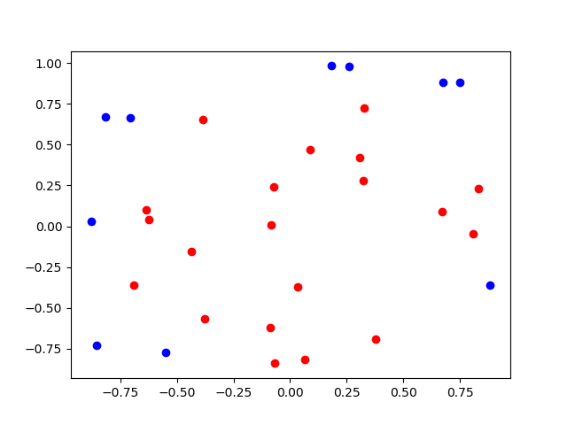
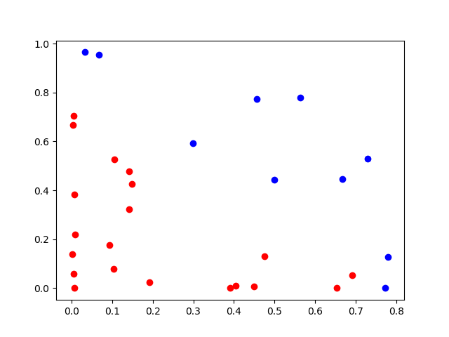

# Basis Functions

Your reading last night reintroduced you to a very simple, but **very**
powerful idea: the features we build our linear models out of don't have to
be the same ones we actually first observed.  As a reminder, here's an example from earlier in the semester.

Suppose we had the following dataset, and we wanted to do classification.  For
each datapoint, we've observed two numbers, $x$ and $y$, and we've plotted
those points here, with the colors indicating their class.

None of our models would do a very good job on this dataset with the features
as described.  A perceptron would run forever, because it's not linearly
separable.  A logistic regressor would finish, and would do its best, but its
best would be some garbage, because the decision boundary is a line, and
there's no good line to draw here.  So, we're hosed, right?  No.

Suppose rather than making datapoint $d_i$ defined as $d_i=[x,y]$, I instead
defined it as $d_i=[x^2,y^2]$.  Then, our data would look like this:

And that's totally linearly separable! We could build an excellent classifier!
This is what makes a seemingly limited linear model into a powerful predictor
- if we can find a transformation to our observations that splits our data
pretty well, then we can solve our problem with a very simple and easily understood linear model.  This is really important!

I'm going to talk about this in terms of regression, but the concepts apply to classification, as well.

To formalize this a little bit, suppose each datapoint is denoted $(x_i,y_i)$, and $x_i$ is a point in $m$ dimensions.  In linear regression, we would stack all of our $x_i$s into a single $n\times m$ matrix $X$, and all of our $y_i$s into a matrix $y$ and then solve for $w$ such that $Xw\approx y$.  However, it may be that our original observations aren't cutting it.  What this means is that either (1) $y$ is not close to the vector space defined by the columns of $X$, and so no sufficiently good $w$ exists, or, (2) the vector space is *too big*, and even the noise in $y$ can be captured, and so we have overfitting.

Instead, we're going to define a series of $k$ basis functions $\phi_1 \dots \phi_k$ which each take in a whole point $x_i$, and output a single scalar.  Then, we can construct a matrix

$$
\Phi=\left[\begin{array}{cccc}
\phi_1(x_1)&\phi_2(x_1)&\dots&\phi_k(x_1)\\
\phi_1(x_2)&\phi_2(x_2)&\dots&\phi_k(x_2)\\
\vdots&\vdots&\dots&\vdots\\
\phi_1(x_n)&\phi_2(x_n)&\dots&\phi_k(x_n)
\end{array}\right],
$$

and solve for a $w$ such that $\Phi w\approx y$.  Let's denote a single row of this matrix, corresponding to datapoint $x_i$ as $\Phi(x_i)$.  The goal is to find features such that the span of $\Phi$ results in a better prediction than the span of $X$.  Obviously, to apply the learned $w$ to a new (testing) point $x_{new}$, you would first have to calculate $\Phi(x_{new})$, then multiply by $w$ to calculate your prediction.

So what kinds of functions might people make?

## Domain Expertise

It may be that you know something about your dataset, and you can make up some features that can improve things.  For example, maybe you're trying to predict, from a dataset of information about people, how many hours per week they work.  One of your features may be age.  With a linear predictor, and age as a feature, you can learn things like, "as age increases, hours working also increase."  But, that's probably not true.  People's hours working jump considerably when they leave school, and drop considerably when they retire.  So, it may be that instead of using age as a feature, you instead want to use a binary feature of "are they between the ages of 18 and 65?"

This is known as feature design, and is a main reason why a machine learning expert can't do all this alone when confronted with a new problem (this is a reason why many BS AI startups fail).  You need somebody in the room who understands this data and can tell you what kinds of things are likely important, so you can turn them into features your model can effectively learn on.

Domain expertise is best.  But, when you don't have domain expertise, you're not totally hosed.  You can instead focus on changing the vector space of your model.  If even after a regularization parameter search, your model sucks, you can focus on widening the span (vector space) of your features, to make it more likely your target vector is close to that span. 

## Dimensionality Reduction

Let's first dispense with the problem of the span of $X$ being *too* expressive.  In this case, we can either add regularization, or we can decrease the expressiveness by using just a few features that capture most of the important information about the data - presumably what's lost is just noise that we don't want to fit anyway.

This is exactly what PCA does for us.  We calculate $\Phi(x_i)$ by projecting $x_i$ onto the first $k$ principal components.  We know these capture most of the important information, and discard the random noise.

Also interesting and truly bananas: [Random projections](https://en.wikipedia.org/wiki/Random_projection). [Random Projections vs PCA](https://stats.stackexchange.com/questions/235632/pca-vs-random-projection).

## Polynomial Features

It may be that your target function isn't linear on your observations.  For example, if your target function looks like $y=x^2$, you're not going to be able to match that very well with a linear function on $x$.  As a result, it's common to try features that consist of monomials constructed from your observations.  For example, if you've observed $[x~y]$, then maybe you want to try $[x^2~y^2~xy~x~y~1]$.  This can add a lot of useful expressiveness.  As stated in your reading, you don't want to take this to too high of a degree, or your function can get unplausibly weirdly shaped.

## Radial Basis Functions (RBFs)

It may be that similarity to certain locations in the input space is a useful feature (over here, it's high; over there, it's low, etc.).  The idea here is to choose $k$ significant locations in the original observation space, and then $\phi_i(x)$ is the distance between $x$ and the $i$th significant location.  "Distance," as usual, can mean a lot of things - most common is Euclidean distance, or the Gaussian distance ($e^{-(\epsilon ||x-x_c||)^2}$, where $x_c$ is the significant location, and $\epsilon$ is a chosen width parameter that determines how far away a point can be before its Gaussian similarity is essentially zero.

These significant locations can be chosen either intentionally based on domain
knowledge, or evenly spaced through the domain, or at randomly sampled points.
