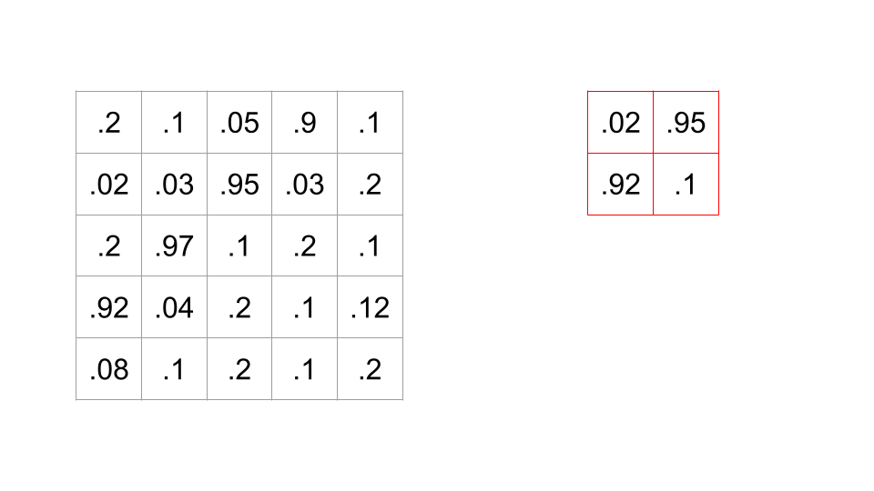
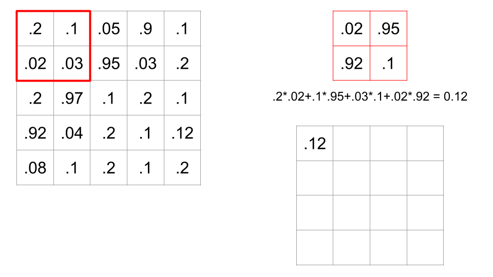
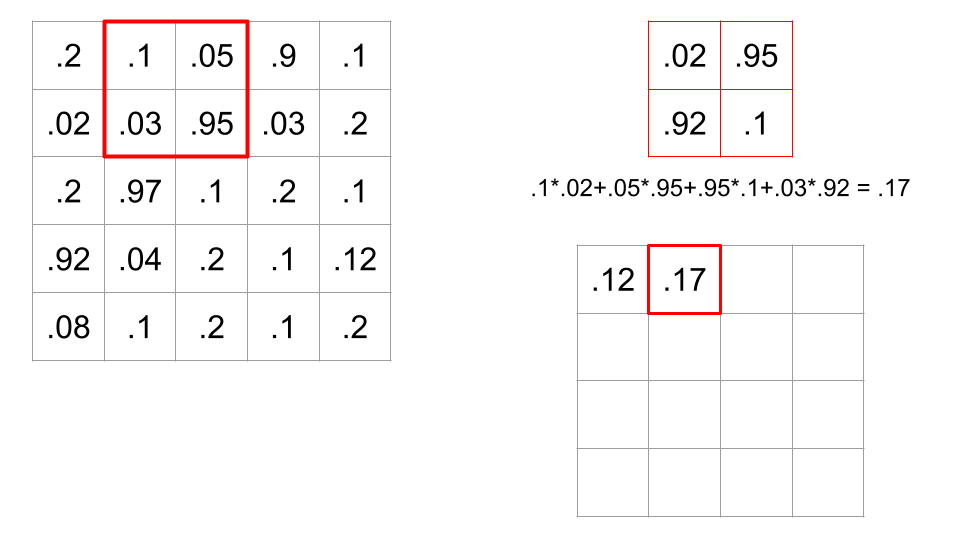
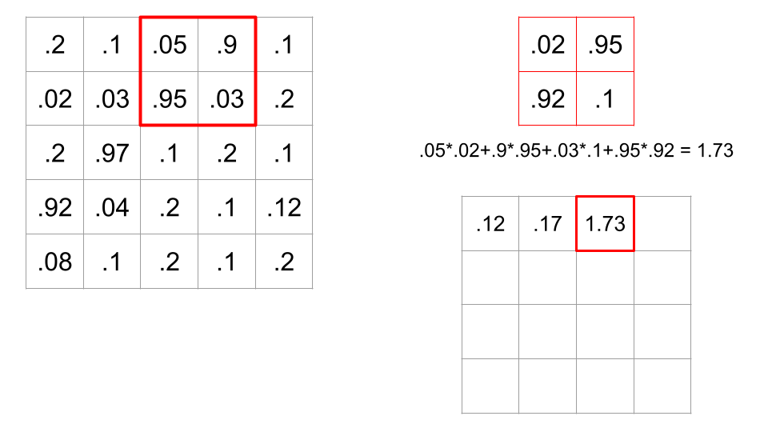
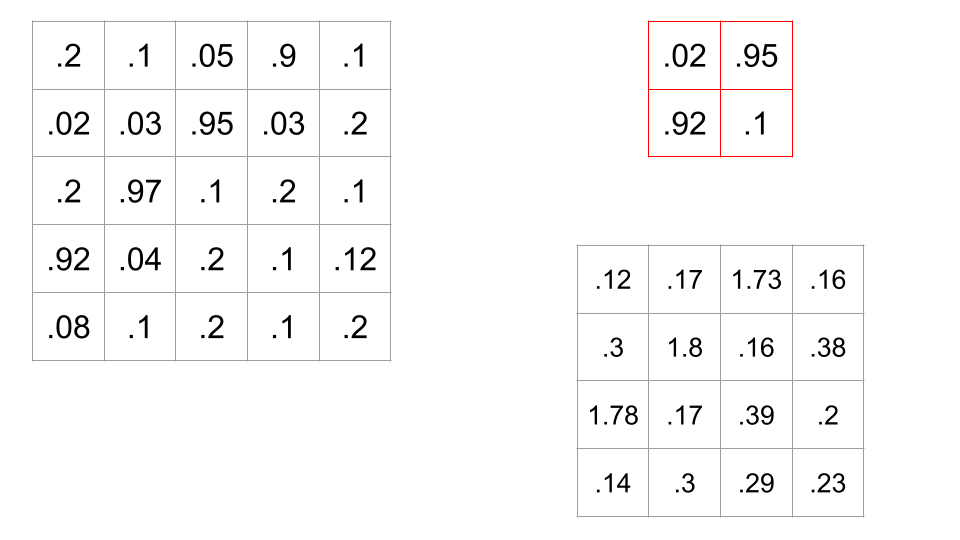
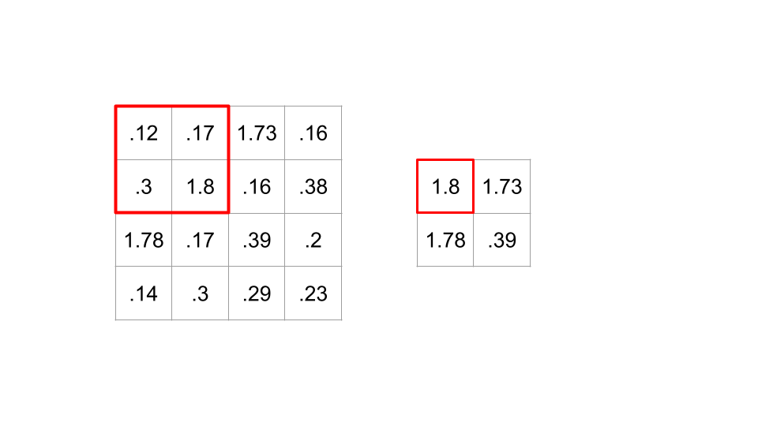

We have learned about how to structure the *back* of our neural networks to be capable of regression or classification.  In addition, we've become comfortable with what we call *dense layers*, where a layer of linear nodes with nonlinear activation functions all connect to every node on the next layer.

It turns out there are other kinds of layers which are more suitable for
specific kinds of data.  This is particularly the case when dealing with
*images* and *language*.  In this class, we're going to look at images.

You may recall that we earlier did an in-class demonstration of the classification of MNIST digits.  In doing this, we took this nice 28x28 image, and flattened it into a single row of length 784.  This was kind of crazy!  What matters for image recognition is the relationship of different pixels to each other, and when we just flatten them, we destroy that relationship (ie, the network has to learn which pixels are adjacent to other pixels, and that that is relevant to its task).

A Convolutional layer is meant to extract meaningful information from 2D blocks of images, rather than looking at the picture as a single row of pixel values.

To understand a convolutional layer, you have to understand a convolution.

Suppose we have this 5x5 black-and-white picture, with these pixel values, and this *filter* (sometimes aka a *kernel*) which is a 2x2 block of numbers.



When we apply this filter to a spot in the image, we do a dot product between the corresponding values of the image and the filter.



In this case, there are sixteen possible 2x2 portions of the image where we could put this filter.  A *convolution* is when we calculate all sixteen of these values, therefore sliding the filter across all possible locations on the image, and calculating this dot product.







Recall that if a dot product between two vectors is high, this means the cosine of the angle between the two vectors is high, meaning the angle is small. So, a large dot product implies the filter and portion of the image are similar.  Convolving a filter across an image is a way of comparing the filter to every part of the image.

A convolutional layer convolves one or more filters across the image, outputting a grid of dot product values for every filter.  This allows the network to see that the image looks like this filter where the values are high, and not where the dot products are small.

Often, a convolutional layer is paired with a nonlinear activation function (like a ReLU), and then fed into a Pooling layer.  The idea behind a pooling layer is that images don't change too much from pixel to pixel, and so we can downsample by taking (for example) 2x2 blocks and only keeping the largest value (this is called a MaxPool).  This shrinks your output grid by half, keeping all this a little more manageable.  Here's the result of applying a MaxPool to the output of the filter above (for the sake of the example, we're skipping the activation function).



So what in here is *learnable*?  It's the values of the filters.  We learn what filters give us the best information about the image to allow for effective regressions/classification/whatever.

A couple terms to know about CNNs:

- The *kernel size* is the size of the filter or kernel.  2x2?  3x3?  5x5?
- A *feature map* is a matrix (or tensor) that captures specific characteristics of the input data, such as patterns, edges, textures, or other relevant features. It is the output of applying a convolutional filter (or kernel) to the input data, like an image (or output of a previous layer). Each filter is trained such that it captures a specific feature (e.g., edges, colors, shapes) in the input data. Applying multiple filters results in and equivalent number of feature maps, each representing different aspects of the input.
- The *stride* is how many pixels to advance before applying the filter again. In the above example, the stride was 1, because we applied it at every possible place - if we had just applied it to every other location, the stride would be 2.
- In order to not cheat the edges and corners, often some *padding* is applied, which is extra rows and columns around the edges to allow the filter to be centered even at locations around the edges.  There are various padding techniques, including just throwing 0s in there, or setting them to the value of the nearest actual pixel.
- The *max pooling* layer is a downsampling function which reduces the spatial dimensions of feature maps, thereby reducing the number of necessary learned parameters of a layer. This reduction in complexity helps both with computational cost and helps the model generalize better by making the feature maps less sensitive to small translations in the input.
- CNN's still typically at least end with a fully connected or dense layer in which the final most complex feature maps learned are combined either for regression, classification, or another purpose.
- *Dropout* is a regularization technique used to prevent overfitting by randomly dropping (i.e., setting to zero) a fraction of the neurons in designated layers during the trainaing process(a predetermined fraction). 
- The final layer often has an activation function like Softmax (for multi-class classification) or Sigmoid (for binary classification).
  
### Code Demo

[Here is a notebook where we demonstrate the creation of a CNN](MnistConv.html).

### Deep ConvNet

As an example of a larger network, here's the summary of AlexNet, one of the most influential and famous models in ML, and one of the first to be trained on GPUs, allowing for many more parameters.  The ImageNet competition is an annual competition to build the classifier that could best classify several million images into 1000 categories.  In 2012, AlexNet defeated the next-best entry by over 10% accuracy; everybody noticed, and the deep network boom began.  AlexNet has over 62 million learnable parameters.

```
AlexNet(
  (features): Sequential(
    (0): Conv2d(3, 64, kernel_size=(11, 11), stride=(4, 4), padding=(2, 2))
    (1): ReLU(inplace=True)
    (2): MaxPool2d(kernel_size=3, stride=2, padding=0, dilation=1, ceil_mode=False)
    (3): Conv2d(64, 192, kernel_size=(5, 5), stride=(1, 1), padding=(2, 2))
    (4): ReLU(inplace=True)
    (5): MaxPool2d(kernel_size=3, stride=2, padding=0, dilation=1, ceil_mode=False)
    (6): Conv2d(192, 384, kernel_size=(3, 3), stride=(1, 1), padding=(1, 1))
    (7): ReLU(inplace=True)
    (8): Conv2d(384, 256, kernel_size=(3, 3), stride=(1, 1), padding=(1, 1))
    (9): ReLU(inplace=True)
    (10): Conv2d(256, 256, kernel_size=(3, 3), stride=(1, 1), padding=(1, 1))
    (11): ReLU(inplace=True)
    (12): MaxPool2d(kernel_size=3, stride=2, padding=0, dilation=1, ceil_mode=False)
  )
  (avgpool): AdaptiveAvgPool2d(output_size=(6, 6))
  (classifier): Sequential(
    (0): Dropout(p=0.5, inplace=False)
    (1): Linear(in_features=9216, out_features=4096, bias=True)
    (2): ReLU(inplace=True)
    (3): Dropout(p=0.5, inplace=False)
    (4): Linear(in_features=4096, out_features=4096, bias=True)
    (5): ReLU(inplace=True)
    (6): Linear(in_features=4096, out_features=1000, bias=True)
  )
)
```
