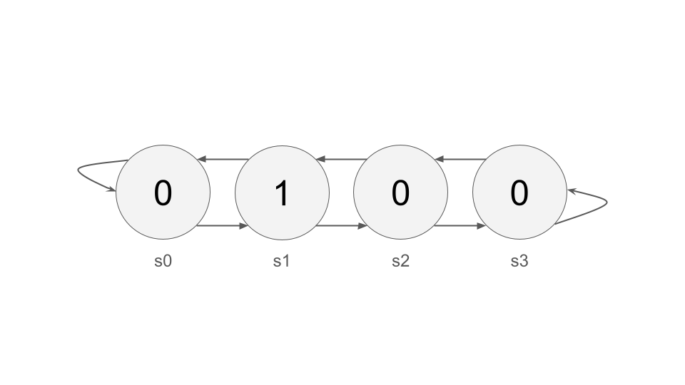

# Intro to Reinforcement Learning

We've learned about several problems in machine learning: Clustering,
Classification, Regression, Embeddings, etc. The remainder of our semester
will be devoted to Reinforcement Learning, or RL.

In RL, the model's job is to learn to perform a particular task by choosing an
action in each moment - for example, given its understanding of the world, how
should an autonomous vehicle respond with its wheel and accelerator right now?
It's a complicated answer.  There's no "right" answer that we can query at any
given timestep like we could if it was classification, where we have a label
telling us what is correct; only much later, when you either get into a car
accident or you're safely delivered to Chipotle, can you know if your actions
were successful or not.

Perhaps the most difficult part of RL is in mathematically defining what "good behavior" is from your autonomous system. What does it mean for one robot to "walk better" from point A to B?  Probably, it avoids collisions, but is faster better?  Smoother, so as to not jostle payloads?  Most energy efficient? Some combination of the above?

## MDPs and Value

To help us think about and calculate these problems, we create a mathematical structure called a *Markov decision process*, or MDP.  An MDP is defined by the following things:

- A *state space* $S$. A state is a complete description of the agent's current scenario (we call the autonomous thing the agent).  The state space is the set of all possible states.  This might be small and discrete, or large, multi-dimensional, and continuous.
- An *action space* $A$. At each timestep, the agent must choose an action to perform. The set of all possible actions is the action space.  Again, this might be small and discrete (to play Pong, you can go up, down, or stay where you are), or multidimensional and continuous (to walk a robot, we have to set actuator values for every joint in the robot's leg, each of which is a continuous value).
- *Transition probabilities* $P(s'|s,a)$. This is physics, or the rules of the game, which expresses how agents move through the space. $P(s' | s,a)$ is the probability of ending up at state $s'$ given that the agent was in state $s$ and took action $a$.
- The *reward function* $R(s)$. In order to communicate success to the model, we give every state a reward.  For example, a state where the agent has achieved its task might get a reward of 10, while a state where the agent has fallen off a cliff might get a reward of -100.
- The *discount value* $\gamma$ (that's the Greek letter gamma). In general, we prefer to get reward sooner than later.  The discount value is a number between 0 and 1 which quantifies this - values close to 0 express more impatience, and values close to 1 indicate more patience.

Our agent interacts with this MDP by observing its state, then choosing an action, and observing the next state and the reward of that next step.  It performs this loop over and over again until the interaction ends.

Our goal is to develop a *policy* $\pi$, which is a function that takes in a
state and returns an action.  A good policy is one that chooses actions for
each state, and ultimately achieves the task.  We quantify this as wanting to
maximize experienced, discounted rewards; that is, if we call $R(s_t)$ the
reward of the state experienced at state $t$, we want to maximize $\sum_t
\gamma^t R(s_t)$.  This sum is known as the *value* of state $s_0$.
Importantly, aside from the MDP, this value depends on a number of things:
- the current state $s$,
- the action you take at this state $a$, and
- the expected behavior (policy $\pi$) for the rest of the experiment (for
  example, a good choice now, followed by a devastating choice later, would
  still have low value).

So, we denote this value with the Q-function $Q_\pi(s,a)$.

Consider, for example, this very simple MDP.  There are 4 states (denoted
$s0$, $s1$, etc.), each represented by a circle.  The reward of that state is
represented by the number in the circle.  The action space at each state is to go either left or right.  We would like to identify a policy that results in a high value.  Suppose $\gamma=.9$.

Let's start by assuming a policy where we always go left (call it $\pi_L$). We
can start by calculating the Q-value, for each state, of always going left
($Q(s,L)$ for all $s$). If we start at $s0$, we receive a reward of 0, and
then continually, forever, ending our transition at state $s0$, continually
receiving a reward of 0, which is scaled by being multiplied by 0: $0+\gamma
0+\gamma^2 0+\gamma^3 0+\cdots$.  So, $Q_{\pi_L}(s0,L)=0$.

From $s1$, we receive a reward of 1, followed by an infinite sum of 0s, so
$Q_{\pi_L}(s1,L)=1$.  It makes sense that $s1$'s value under this policy is higher than that of state $s0$.  Were this our policy, we would definitely prefer to get one reward than none at all, so the value is higher.

From $s2$, we receive a reward of 0, followed by a 1, followed by an infinite
sum of 0s. $Q_{\pi_L}(s2,L)=0 + \gamma 1 + \gamma^2 0 + \gamma ^3 0 + \cdots = .9$ (because $\gamma=.9$).  Again, this makes sense.  State $s2$ is preferable to state $s0$, but less preferred than state $s1$ (because in state $s1$ we get the reward faster).  So, its value is higher than that of state $s0$ and lower than that of state $s1$.

The value of state $s3$ is .81 (see why?).  So, the values of all four, when
we choose to go left, with a future policy of always going left, are [0, 1, .9, .81].

We can also calculate $Q_{\pi_L}(s,R)$. This means that we choose, right now,
to go right, but then follow $\pi_L$ from then on. For example,
$Q_{\pi_L}(s0,R)=0+\gamma 1 + \gamma^2 0 + ... = .9$, because you get 0 at the
first timestep, then go right to receive the 1 from state $s1$, and then left
from then on. We can complete the table:

### Q-Value Tables

| State | $Q_{\pi_L}(s,L)$ | $Q_{\pi_L}(s,R)$ |
|-------|------------------|------------------|
| s0    | 0                | 0.9              |
| s1    | 1                | 1.81             |
| s2    | 0.9              | 0.729            |
| s3    | 0.81             | 0.729            |

| State | $Q_{\pi_R}(s,L)$ | $Q_{\pi_R}(s,R)$ |
|-------|------------------|------------------|
| s0    | 0.81             | 0.9              |
| s1    | 11.81            | 1.811            |
| s2    | 0.9              | 0                |
| s3    | 0                | 0                |

## Comparing Policies

The value of a state under a given policy, denoted $V_\pi(s)$, is equal to the Q-value of taking policy $\pi$'s prescribed action at that state. We use these state values to directly compare policies. A policy is considered optimal or strictly superior to another if its expected return is greater than or equal to the alternative for all possible states in the MDP.

Comparing the values of $\pi_L$ (using $Q_{\pi_L}(s, L)$) and $\pi_R$ (using $Q_{\pi_R}(s, R)$):

  - State values for $\pi_L$ are [0, 1, 0.9, 0.81].
  - State values for $\pi_R$ are [0.9, 1, 0, 0].

Neither policy is strictly better across the entire state space. Policy $\pi_R$ yields a higher value if the agent starts at $s0$, as it directs the agent toward the reward at $s1$. Conversely, $\pi_L$ yields a higher value if the agent starts at $s2$ or $s3$, as it directs the agent leftward back toward the reward at $s1$.

## Improving a Policy

Q-values provide a mathematical mechanism for policy improvement. By evaluating an existing policy to find all of its Q-values, we can extract a new, strictly improved (or equal) policy by acting greedily with respect to those values. This involves simply selecting the action that yields the highest Q-value at each individual state.

Applying this improvement process to $Q_{\pi_L}$:

  - At $s0$, $Q_{\pi_L}(s0, R) > Q_{\pi_L}(s0, L)$. The improved action is Right.
  - At $s1$, $Q_{\pi_L}(s1, R) > Q_{\pi_L}(s1, L)$. The improved action is Right.
  - At $s2$, $Q_{\pi_L}(s2, L) > Q_{\pi_L}(s2, R)$. The improved action is Left.
  - At $s3$, $Q_{\pi_L}(s3, L) > Q_{\pi_L}(s3, R)$. The improved action is Left.

By extracting the mathematical maximum across each state row, we define a new policy that instructs the agent to go Right at $s0$ and $s1$, and Left at $s2$ and $s3$. This process is mathematically guaranteed to output a policy that produces equal or greater discounted rewards compared to the original policy.

We can therefore create an algorithm called **policy iteration**, where we start with a random policy, compute the Q-values, improve the policy based on those Q-values, recompute the Q-values (because the future behavior has changed), and repeat until convergence.

## So are we done?

Maybe it seems that way. First we perform policy iteration, create the optimal policy, and then at each state, choose the action designated by that final policy, and you'll get ideal autonomous behavior without much deploy-time computation.

However, this approach has several limitations.

1. This approach assumes a very small state space (because you have to create and represent a table with $|S|$ rows).
2. This approach assumes a very small action space (for the same reason).
3. This approach assumes the ability to calculate an exact Q-value for every state-action pair (which is not feasible as policies become complex).

We're going to work on removing those assumptions during the remainder of the semester.