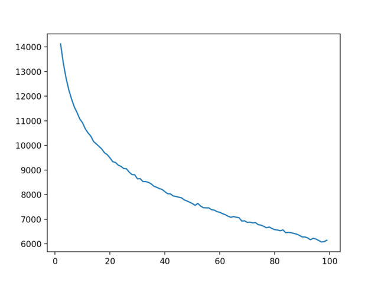
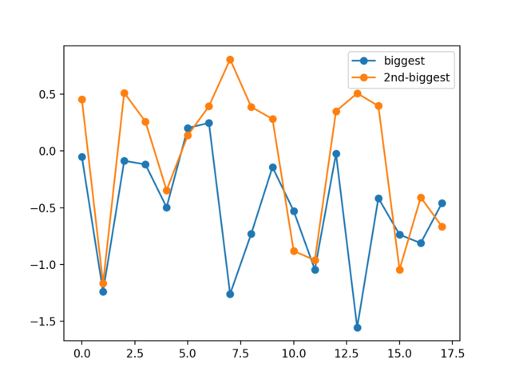
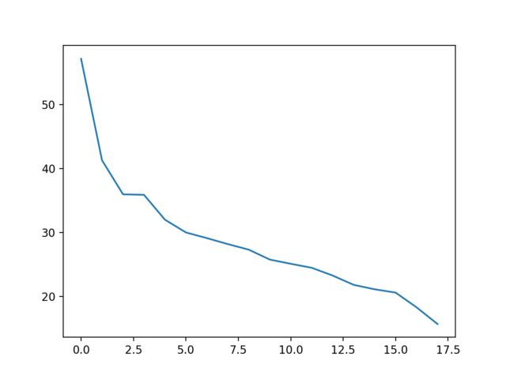
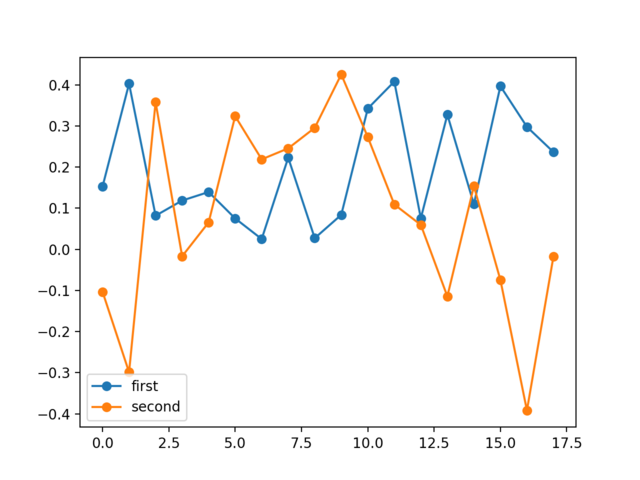

#Applying Unsupervised Learning to a Dataset

Unsupervised learning inherently involves a human in the loop to make
modeling decisions and interpret the results.  Let's apply what we've learned
to the rankings of foods that people have done for us.

###Clustering

Important questions to ask when clustering is, which type of clustering should
we do, (if appropriate) how many clusters do we think there are, and how
should we measure distance?  I'm not going to engage with them all, but let's
first look at how many clusters there could be if we use K-Means.

Here, I've plotted $k$ on the x-axis, and the total distance of all points
from their nearest centroids on the y-axis.

We can see that while the distance is constantly trending down (as we would
expect), the marginal benefit of adding another cluster flattens out at, what,
maybe 30 clusters?  Let's go with 30 clusters.

So, we do K-Means with 30 clusters, and take a look at the centroids.  Now,
each centroid is a point in 18-dimensional space, which can make them
difficult to think about.  But the question I'd like to ask is, if there
really are 30 different kinds of food-liking people, how do they differ?  As
an illustration, let's take the two biggest clusters (which doesn't inherently
make them more interesting, but gives us a place to start), and look at, for
each food, how much more or less than the average does this kind of person
like each of these foods?  To do this, we take the centroid values, and
subtract the mean ranking of each food from each dimension, so positive
numbers means that kind of person likes it more than average, and negative
means that kind of person likes it less.

For reference, the 18 dimensions are:
(0, 'Broccoli'), (1, 'Mushrooms'), (2, 'Beef Tacos'), (3, 'Salads'),
(4, 'Black Licorice'), (5, 'Steak'), (6, 'Grilled Chicken'), (7, 'Mayonnaise'),
(8, 'Candy Corn'), (9, 'Pulled Pork'), (10, 'Spicy Mustard'),
(11, 'Raw Oysters'), (12, 'Bananas'), (13, 'Avocado'), (14, 'Eggs'),
(15, 'Olives'), (16, 'Tofu'), (17, 'Cottage Cheese')

These two groups are pretty similar, except for a couple points of strong
disagreement.  Both are strongly negative towards mushrooms, but disagree
strongly on mayonnaise, candy corn, avocado, and eggs.  I'd rather feed an
orange person than a blue person!

Because K-Means gives you a different answer each time, it's probably best to
look for trends over many different runs.  If I do this a lot, I notice that
avocados tend to be the strongest point of disagreement between the two
biggest clusters.

###PCA

The next question we might ask is if there's some underlying low-dimensional
explanation for our data.  So, we center the mean of the data at the origin,
take the SVD, and look at the singular values.

It looks like there are definitely two-four really strong principal components
which explain a lot of the variance in the data.  What are they?  As with
clustering, the principal components are vectors in 18-dimensional space, in
this case of length one.  My question is, for each of these top two
components, what portion of each vector is in each of the 18 dimensions?

The x-axis corresponds to each of the original 18 dimensions, as listed here:
(0, 'Broccoli'), (1, 'Mushrooms'), (2, 'Beef Tacos'), (3, 'Salads'),
(4, 'Black Licorice'), (5, 'Steak'), (6, 'Grilled Chicken'), (7, 'Mayonnaise'),
(8, 'Candy Corn'), (9, 'Pulled Pork'), (10, 'Spicy Mustard'),
(11, 'Raw Oysters'), (12, 'Bananas'), (13, 'Avocado'), (14, 'Eggs'),
(15, 'Olives'), (16, 'Tofu'), (17, 'Cottage Cheese')

Here, I've plotted the top two components.  The blue line is the first
component.  We can see that it is positive in all 18 dimensions - this
component is saying that the main thing that determines how much a person
likes different foods is if they like food at all - liking one food more means
you're likely to like other foods more.  Remember, unlike with clustering, in
which each centroid was a point, this is a vector - people lie somewhere along
the line defined by the vector space of this component.  So, an individual
person can be more like this, or less like this.  The fact that it's the first
principal component means how much you're like this explains your rankings
more than any other axis.

The second component is what I'm calling the "18-year-old-dude" component, one
I've recognized well after several years of feeding sponsor midshipmen.
Remember, after we remove all variance explained by the first principal
component, the second principal component is the vector that best explains the
remaining variance.  Here, an increase in preference for beef tacos, steak,
and pulled pork is correlated with a decrease in preference for broccoli,
mushrooms, avocado, and tofu (similarly, an increase in preference for the
vegetables is correlated with a decrease in preference for the meat).  That
seems about right!

The code that made these graphs is available in the course git repo, as
`class/svd/foodAnalysis.py`.
